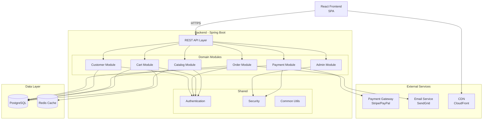
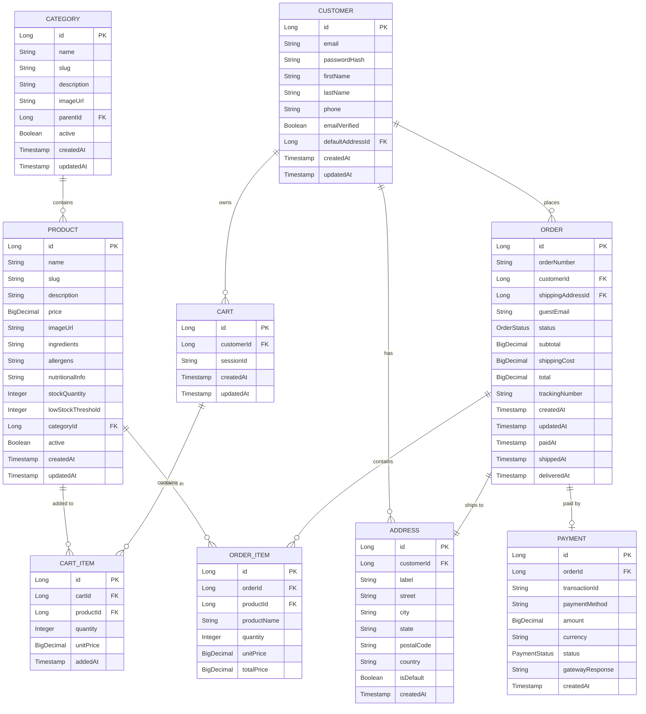
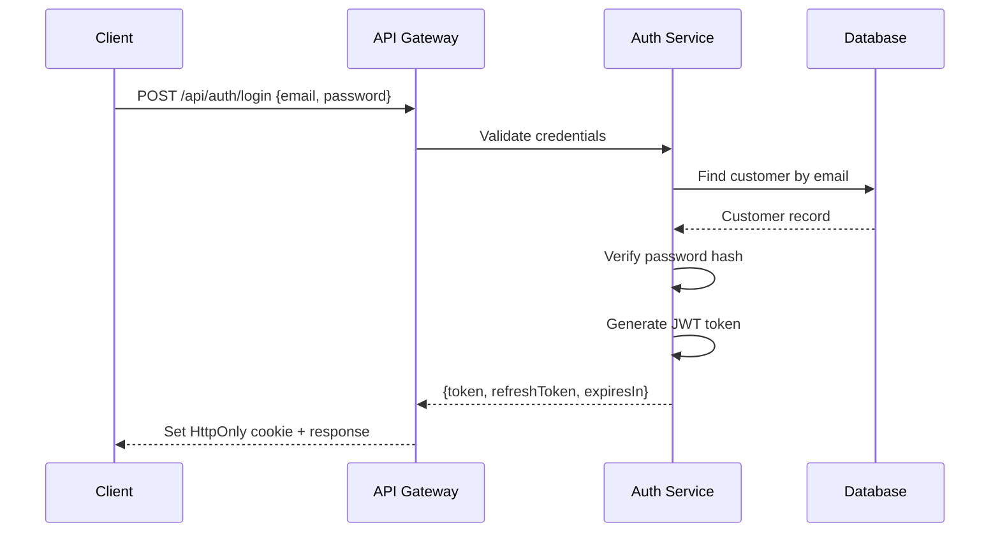

# Design Document: Cookies Store E-Commerce Platform

## Overview

Este sistema implementa una tienda en línea de galletas artesanales utilizando Spring Boot con una arquitectura modular gestionada por Gradle. El sistema permite a clientes explorar productos, gestionar carritos, realizar pedidos y rastrear entregas, mientras que administradores gestionan inventario y procesan pedidos.

La arquitectura se basa en un monolito modular para el MVP, con clara separación de dominios que permite evolución hacia microservicios si es necesario.

## Architecture

### High-Level Architecture



### Module Structure

```
cookies-store/
├── build.gradle (root)
├── settings.gradle
├── common/
│   ├── auth-common/
│   │   └── build.gradle
│   ├── security-common/
│   │   └── build.gradle
│   ├── authorization-common/          # NEW: Domain-Ability-Permission
│   │   └── build.gradle
│   └── common-utils/
│       └── build.gradle
├── catalog-module/
│   ├── build.gradle
│   └── src/main/java/com/cookies/catalog/
├── cart-module/
│   ├── build.gradle
│   └── src/main/java/com/cookies/cart/
├── customer-module/
│   ├── build.gradle
│   └── src/main/java/com/cookies/customer/
├── order-module/
│   ├── build.gradle
│   └── src/main/java/com/cookies/order/
├── payment-module/
│   ├── build.gradle
│   └── src/main/java/com/cookies/payment/
├── admin-module/
│   ├── build.gradle
│   └── src/main/java/com/cookies/admin/
└── application/
    ├── build.gradle
    └── src/main/java/com/cookies/CookiesStoreApplication.java
```

### Authorization Module Structure

```
authorization-common/
└── src/main/java/com/cookies/authorization/
    ├── domain/
    │   ├── Domain.java
    │   ├── Ability.java
    │   ├── Permission.java
    │   ├── UserDomainAbility.java
    │   └── UserDomainPermissionOverride.java
    ├── repository/
    │   ├── DomainRepository.java
    │   ├── AbilityRepository.java
    │   ├── PermissionRepository.java
    │   ├── UserDomainAbilityRepository.java
    │   └── UserDomainPermissionOverrideRepository.java
    ├── service/
    │   └── DomainAuthorizationService.java
    ├── annotation/
    │   ├── RequiresPermission.java
    │   └── RequiresAbility.java
    ├── evaluator/
    │   └── DomainAuthorizationEvaluator.java
    └── config/
        └── AuthorizationConfig.java
```

### Technology Stack

| Layer | Technology |
|-------|------------|
| Framework | Spring Boot 3.2.x |
| Build Tool | Gradle 8.x |
| Language | Java 21+ |
| Database | PostgreSQL 15+ |
| Cache | Redis 7+ |
| ORM | Spring Data JPA / Hibernate |
| Security | Spring Security + JWT |
| API | REST with OpenAPI 3.0 |
| Validation | Jakarta Bean Validation |
| Testing | JUnit 5, Mockito, TestContainers, jqwik |
| Frontend | React 18 + TypeScript |
| Payment | Stripe API |
| Email | SendGrid |

## Data Model

### Entity Relationship Diagram



### Enum Definitions

```java
public enum OrderStatus {
    PENDING,      // Order created, awaiting payment
    PAID,         // Payment confirmed
    PREPARING,    // Order being prepared
    SHIPPED,      // Order shipped
    DELIVERED,    // Order delivered
    CANCELLED     // Order cancelled
}

public enum PaymentStatus {
    PENDING,
    COMPLETED,
    FAILED,
    REFUNDED
}
```

## Components and Interfaces

### Catalog Module

**ProductController**
```java
@RestController
@RequestMapping("/api/products")
public class ProductController {
    
    @GetMapping
    ResponseEntity<Page<ProductSummaryDTO>> getProducts(
        @RequestParam(required = false) Long categoryId,
        @RequestParam(required = false) String search,
        Pageable pageable
    );
    
    @GetMapping("/{slug}")
    ResponseEntity<ProductDetailDTO> getProductBySlug(@PathVariable String slug);
    
    @GetMapping("/{id}/related")
    ResponseEntity<List<ProductSummaryDTO>> getRelatedProducts(@PathVariable Long id);
}
```

**CategoryController**
```java
@RestController
@RequestMapping("/api/categories")
public class CategoryController {
    
    @GetMapping
    ResponseEntity<List<CategoryDTO>> getAllCategories();
    
    @GetMapping("/{slug}")
    ResponseEntity<CategoryDTO> getCategoryBySlug(@PathVariable String slug);
    
    @GetMapping("/{slug}/products")
    ResponseEntity<Page<ProductSummaryDTO>> getCategoryProducts(
        @PathVariable String slug,
        Pageable pageable
    );
}
```

### Cart Module

**CartController**
```java
@RestController
@RequestMapping("/api/cart")
public class CartController {
    
    @GetMapping
    ResponseEntity<CartDTO> getCart(
        @AuthenticationPrincipal UserPrincipal user,
        @CookieValue(required = false) String sessionId
    );
    
    @PostMapping("/items")
    ResponseEntity<CartDTO> addItem(
        @RequestBody AddToCartRequest request,
        @AuthenticationPrincipal UserPrincipal user,
        @CookieValue(required = false) String sessionId
    );
    
    @PutMapping("/items/{itemId}")
    ResponseEntity<CartDTO> updateItemQuantity(
        @PathVariable Long itemId,
        @RequestBody UpdateQuantityRequest request
    );
    
    @DeleteMapping("/items/{itemId}")
    ResponseEntity<CartDTO> removeItem(@PathVariable Long itemId);
    
    @DeleteMapping
    ResponseEntity<Void> clearCart();
}
```

**CartService**
```java
@Service
public class CartService {
    
    Cart getOrCreateCart(Long customerId, String sessionId);
    
    Cart addItem(Long cartId, Long productId, int quantity);
    
    Cart updateItemQuantity(Long cartId, Long itemId, int quantity);
    
    Cart removeItem(Long cartId, Long itemId);
    
    void clearCart(Long cartId);
    
    void mergeGuestCart(String sessionId, Long customerId);
    
    CartDTO toDTO(Cart cart);
}
```

### Customer Module

**AuthController**
```java
@RestController
@RequestMapping("/api/auth")
public class AuthController {
    
    @PostMapping("/register")
    ResponseEntity<AuthResponseDTO> register(@RequestBody RegisterRequest request);
    
    @PostMapping("/login")
    ResponseEntity<AuthResponseDTO> login(@RequestBody LoginRequest request);
    
    @PostMapping("/logout")
    ResponseEntity<Void> logout();
    
    @PostMapping("/forgot-password")
    ResponseEntity<Void> forgotPassword(@RequestBody ForgotPasswordRequest request);
    
    @PostMapping("/reset-password")
    ResponseEntity<Void> resetPassword(@RequestBody ResetPasswordRequest request);
    
    @GetMapping("/verify-email")
    ResponseEntity<Void> verifyEmail(@RequestParam String token);
}
```

**CustomerController**
```java
@RestController
@RequestMapping("/api/customers/me")
public class CustomerController {
    
    @GetMapping
    ResponseEntity<CustomerDTO> getProfile(@AuthenticationPrincipal UserPrincipal user);
    
    @PutMapping
    ResponseEntity<CustomerDTO> updateProfile(
        @AuthenticationPrincipal UserPrincipal user,
        @RequestBody UpdateProfileRequest request
    );
    
    @GetMapping("/addresses")
    ResponseEntity<List<AddressDTO>> getAddresses(@AuthenticationPrincipal UserPrincipal user);
    
    @PostMapping("/addresses")
    ResponseEntity<AddressDTO> addAddress(
        @AuthenticationPrincipal UserPrincipal user,
        @RequestBody CreateAddressRequest request
    );
    
    @PutMapping("/addresses/{addressId}")
    ResponseEntity<AddressDTO> updateAddress(
        @PathVariable Long addressId,
        @RequestBody UpdateAddressRequest request
    );
    
    @DeleteMapping("/addresses/{addressId}")
    ResponseEntity<Void> deleteAddress(@PathVariable Long addressId);
    
    @PutMapping("/addresses/{addressId}/default")
    ResponseEntity<Void> setDefaultAddress(@PathVariable Long addressId);
}
```

### Order Module

**CheckoutController**
```java
@RestController
@RequestMapping("/api/checkout")
public class CheckoutController {
    
    @PostMapping("/validate")
    ResponseEntity<CheckoutValidationDTO> validateCart(
        @AuthenticationPrincipal UserPrincipal user
    );
    
    @PostMapping
    ResponseEntity<OrderDTO> createOrder(
        @AuthenticationPrincipal UserPrincipal user,
        @RequestBody CreateOrderRequest request
    );
}
```

**OrderController**
```java
@RestController
@RequestMapping("/api/orders")
public class OrderController {
    
    @GetMapping
    ResponseEntity<Page<OrderSummaryDTO>> getOrders(
        @AuthenticationPrincipal UserPrincipal user,
        Pageable pageable
    );
    
    @GetMapping("/{orderNumber}")
    ResponseEntity<OrderDetailDTO> getOrder(
        @AuthenticationPrincipal UserPrincipal user,
        @PathVariable String orderNumber
    );
    
    @PostMapping("/{orderNumber}/cancel")
    ResponseEntity<OrderDTO> cancelOrder(
        @AuthenticationPrincipal UserPrincipal user,
        @PathVariable String orderNumber
    );
}
```

**OrderService**
```java
@Service
public class OrderService {
    
    Order createOrder(Long customerId, Long addressId, String guestEmail);
    
    Order getOrder(String orderNumber);
    
    List<Order> getCustomerOrders(Long customerId);
    
    Order cancelOrder(String orderNumber, Long customerId);
    
    Order updateStatus(String orderNumber, OrderStatus status);
    
    Order addTrackingNumber(String orderNumber, String trackingNumber);
}
```

### Payment Module

**PaymentController**
```java
@RestController
@RequestMapping("/api/payments")
public class PaymentController {
    
    @PostMapping("/intent")
    ResponseEntity<PaymentIntentDTO> createPaymentIntent(
        @RequestBody CreatePaymentIntentRequest request
    );
    
    @PostMapping("/confirm")
    ResponseEntity<PaymentResultDTO> confirmPayment(
        @RequestBody ConfirmPaymentRequest request
    );
    
    @PostMapping("/webhook")
    ResponseEntity<Void> handleWebhook(
        @RequestBody String payload,
        @RequestHeader("Stripe-Signature") String signature
    );
}
```

**PaymentService**
```java
@Service
public class PaymentService {
    
    PaymentIntent createPaymentIntent(Long orderId, BigDecimal amount);
    
    Payment processPayment(String paymentIntentId);
    
    Payment refundPayment(Long paymentId);
    
    void handleWebhookEvent(String payload, String signature);
}
```

### Admin Module

**AdminProductController**
```java
@RestController
@RequestMapping("/api/admin/products")
@PreAuthorize("hasRole('ADMIN')")
public class AdminProductController {
    
    @PostMapping
    ResponseEntity<ProductDTO> createProduct(@RequestBody CreateProductRequest request);
    
    @PutMapping("/{id}")
    ResponseEntity<ProductDTO> updateProduct(
        @PathVariable Long id,
        @RequestBody UpdateProductRequest request
    );
    
    @PutMapping("/{id}/stock")
    ResponseEntity<ProductDTO> updateStock(
        @PathVariable Long id,
        @RequestBody UpdateStockRequest request
    );
    
    @PutMapping("/{id}/status")
    ResponseEntity<Void> toggleProductStatus(@PathVariable Long id);
}
```

**AdminOrderController**
```java
@RestController
@RequestMapping("/api/admin/orders")
@PreAuthorize("hasRole('ADMIN')")
public class AdminOrderController {
    
    @GetMapping
    ResponseEntity<Page<OrderSummaryDTO>> getOrders(
        @RequestParam(required = false) OrderStatus status,
        Pageable pageable
    );
    
    @PutMapping("/{orderNumber}/status")
    ResponseEntity<OrderDTO> updateOrderStatus(
        @PathVariable String orderNumber,
        @RequestBody UpdateOrderStatusRequest request
    );
    
    @PutMapping("/{orderNumber}/tracking")
    ResponseEntity<OrderDTO> addTrackingNumber(
        @PathVariable String orderNumber,
        @RequestBody AddTrackingRequest request
    );
}
```

## API Response Format

### Success Response

```json
{
    "success": true,
    "data": { },
    "error": null,
    "timestamp": "2026-02-10T12:00:00Z"
}
```

### Error Response

```json
{
    "success": false,
    "data": null,
    "error": {
        "code": "PRODUCT_NOT_FOUND",
        "message": "Product with id 123 not found",
        "details": []
    },
    "timestamp": "2026-02-10T12:00:00Z"
}
```

### Validation Error Response

```json
{
    "success": false,
    "data": null,
    "error": {
        "code": "VALIDATION_ERROR",
        "message": "Validation failed",
        "details": [
            {"field": "email", "message": "must be a valid email address"},
            {"field": "password", "message": "must be at least 8 characters"}
        ]
    },
    "timestamp": "2026-02-10T12:00:00Z"
}
```

## Security Architecture

### Authentication Flow



### JWT Token Structure

```json
{
    "sub": "12345",
    "email": "customer@example.com",
    "roles": ["CUSTOMER"],
    "iat": 1707566400,
    "exp": 1707570000
}
```

### Security Measures

| Measure | Implementation |
|---------|----------------|
| Password Storage | BCrypt (cost factor 12) |
| Transport | HTTPS only (HSTS enabled) |
| CSRF | SameSite cookies + CSRF token |
| Rate Limiting | 10 req/min for auth endpoints |
| Input Validation | Bean Validation + sanitization |
| SQL Injection | Parameterized queries (JPA) |
| XSS | Content-Security-Policy headers |

## Caching Strategy

### Cache Layers

| Data | Cache | TTL | Invalidation |
|------|-------|-----|--------------|
| Product catalog | Redis | 5 min | On product update |
| Categories | Redis | 1 hour | On category update |
| Cart | Redis | 24 hours | On modification |
| Product images | CDN | 1 week | Version query param |

### Cache Keys

```
catalog:products:page:{page}:size:{size}
catalog:products:category:{categoryId}:page:{page}
catalog:product:{slug}
catalog:categories:all
cart:customer:{customerId}
cart:session:{sessionId}
```

## Scalability Plan

| Scale | Users | Architecture Changes |
|-------|-------|----------------------|
| MVP | 1K | Monolith, single DB, basic cache |
| Growth | 10K | Read replicas, Redis cluster, CDN |
| Scale | 100K | Microservices split, message queues |
| Enterprise | 1M+ | Multi-region, event sourcing, CQRS |

## ADR-001: Monolith-First Architecture

### Context
Building a new e-commerce platform for selling artisanal cookies.

### Decision
Start with a modular monolith rather than microservices.

### Consequences

**Positive**
- Faster initial development
- Simpler deployment and operations
- Easier debugging and testing
- Lower infrastructure costs

**Negative**
- Scaling is vertical first
- All modules share same deployment cycle
- Potential for coupling if not careful

**Mitigation**
- Clear module boundaries with well-defined interfaces
- Database schemas per module (shared DB, logical separation)
- Design for future extraction to microservices

### Status
Accepted

### Date
2026-02-10
