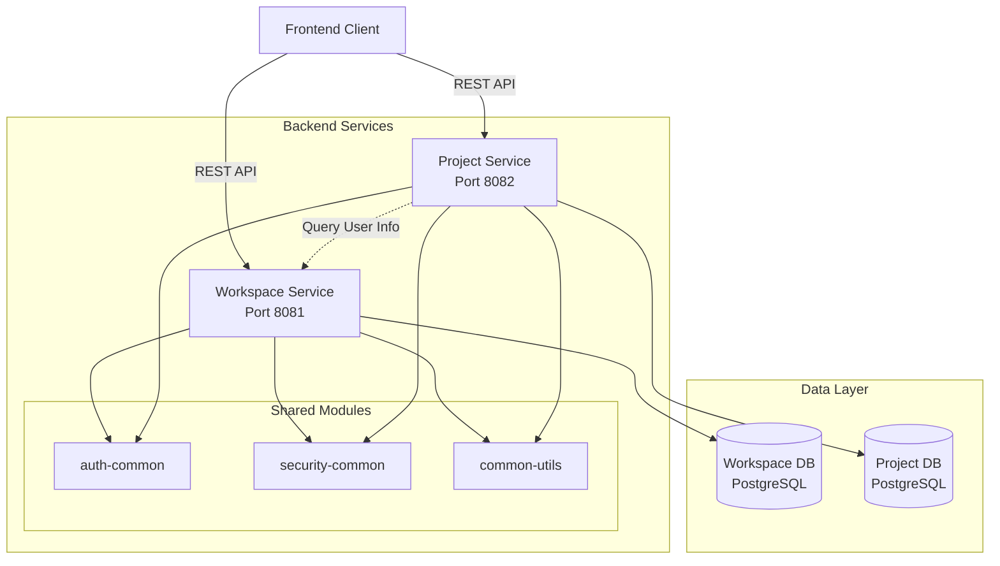

# Design Document: Collaborative Document Management System

## Overview

Este sistema implementa una plataforma colaborativa de gestión de documentos utilizando Spring Boot con una arquitectura multi-módulo gestionada por Gradle. El sistema permite a usuarios con diferentes roles (Author, Editor, Consultant) trabajar en proyectos documentales a través de un flujo de estados bien definido, con soporte para propuestas de cambio colaborativas, discusiones, y versionado completo.

La arquitectura se divide en dos aplicaciones principales:
- **Workspace Service**: Gestiona workspaces, usuarios y membresías
- **Project Service**: Gestiona proyectos, roles, contenido, propuestas y versiones

Ambos servicios comparten módulos comunes para autenticación, seguridad y utilidades.

## Architecture

### High-Level Architecture



### Gradle Multi-Module Structure

```
collaborative-document-management/
├── build.gradle (root)
├── settings.gradle
├── common/
│   ├── auth-common/
│   │   └── build.gradle
│   ├── security-common/
│   │   └── build.gradle
│   └── common-utils/
│       └── build.gradle
├── workspace-service/
│   ├── build.gradle
│   └── src/main/java/com/cdm/workspace/
└── project-service/
    ├── build.gradle
    └── src/main/java/com/cdm/project/
```

### Technology Stack

- **Framework**: Spring Boot 3.2.x
- **Build Tool**: Gradle 8.x
- **Language**: Java 17+
- **Database**: PostgreSQL 15+
- **ORM**: Spring Data JPA with Hibernate
- **Security**: Spring Security with JWT
- **API**: REST with Spring Web
- **Validation**: Jakarta Bean Validation
- **Testing**: JUnit 5, Mockito, TestContainers

### Communication Patterns

- **Client ↔ Services**: REST APIs with JSON
- **Service ↔ Service**: REST client (WebClient) for workspace user validation
- **Service ↔ Database**: JPA/Hibernate

## Components and Interfaces

### Workspace Service Components

#### 1. Workspace Management

**WorkspaceController**
```java
@RestController
@RequestMapping("/api/workspaces")
public class WorkspaceController {
    
    @PostMapping
    ResponseEntity<WorkspaceDTO> createWorkspace(
        @RequestBody CreateWorkspaceRequest request,
        @AuthenticationPrincipal UserPrincipal user
    );
    
    @GetMapping("/{workspaceId}")
    ResponseEntity<WorkspaceDTO> getWorkspace(@PathVariable Long workspaceId);
    
    @GetMapping
    ResponseEntity<List<WorkspaceDTO>> getUserWorkspaces(
        @AuthenticationPrincipal UserPrincipal user
    );
    
    @PostMapping("/{workspaceId}/members")
    ResponseEntity<Void> inviteMember(
        @PathVariable Long workspaceId,
        @RequestBody InviteMemberRequest request
    );
    
    @DeleteMapping("/{workspaceId}/members/{userId}")
    ResponseEntity<Void> removeMember(
        @PathVariable Long workspaceId,
        @PathVariable Long userId
    );
}
```

**WorkspaceService**
```java
@Service
public class WorkspaceService {
    
    Workspace createWorkspace(String name, String description, Long ownerId);
    
    Workspace getWorkspace(Long workspaceId);
    
    List<Workspace> getUserWorkspaces(Long userId);
    
    void addMember(Long workspaceId, Long userId);
    
    void removeMember(Long workspaceId, Long userId);
    
    boolean isMember(Long workspaceId, Long userId);
    
    void validateOwnership(Long workspaceId, Long userId);
}
```

#### 2. User Management

**UserController**
```java
@RestController
@RequestMapping("/api/users")
public class UserController {
    
    @PostMapping("/register")
    ResponseEntity<UserDTO> register(@RequestBody RegisterRequest request);
    
    @PostMapping("/login")
    ResponseEntity<LoginResponse> login(@RequestBody LoginRequest request);
    
    @GetMapping("/me")
    ResponseEntity<UserDTO> getCurrentUser(@AuthenticationPrincipal UserPrincipal user);
    
    @GetMapping("/{userId}")
    ResponseEntity<UserDTO> getUser(@PathVariable Long userId);
}
```

**UserService**
```java
@Service
public class UserService {
    
    User registerUser(String username, String email, String password);
    
    String authenticateUser(String username, String password);
    
    User getUserById(Long userId);
    
    User getUserByUsername(String username);
    
    boolean existsByUsername(String username);
    
    boolean existsByEmail(String email);
}
```

### Project Service Components

#### 1. Project Management

**ProjectController**
```java
@RestController
@RequestMapping("/api/projects")
public class ProjectController {
    
    @PostMapping
    ResponseEntity<ProjectDTO> createProject(
        @RequestBody CreateProjectRequest request,
        @AuthenticationPrincipal UserPrincipal user
    );
    
    @GetMapping("/{projectId}")
    ResponseEntity<ProjectDTO> getProject(@PathVariable Long projectId);
    
    @GetMapping("/workspace/{workspaceId}")
    ResponseEntity<List<ProjectDTO>> getWorkspaceProjects(
        @PathVariable Long workspaceId
    );
    
    @PutMapping("/{projectId}/state")
    ResponseEntity<ProjectDTO> transitionState(
        @PathVariable Long projectId,
        @RequestBody StateTransitionRequest request
    );
    
    @PutMapping("/{projectId}/content")
    ResponseEntity<Void> updateContent(
        @PathVariable Long projectId,
        @RequestBody UpdateContentRequest request
    );
    
    @PutMapping("/{projectId}/index")
    ResponseEntity<Void> updateIndex(
        @PathVariable Long projectId,
        @RequestBody UpdateIndexRequest request,
        @AuthenticationPrincipal UserPrincipal user
    );
    
    @GetMapping("/{projectId}/index-history")
    ResponseEntity<List<IndexHistoryDTO>> getIndexHistory(
        @PathVariable Long projectId
    );
    
    @PostMapping("/{projectId}/cover-image")
    ResponseEntity<ProjectCoverImageDTO> uploadCoverImage(
        @PathVariable Long projectId,
        @RequestParam("file") MultipartFile file,
        @AuthenticationPrincipal UserPrincipal user
    );
    
    @DeleteMapping("/{projectId}/cover-image")
    ResponseEntity<Void> removeCoverImage(
        @PathVariable Long projectId,
        @AuthenticationPrincipal UserPrincipal user
    );
}
```

**ProjectService**
```java
@Service
public class ProjectService {
    
    Project createProject(
        Long workspaceId,
        String name,
        String description,
        String index,
        String initialContent,
        Long authorId
    );
    
    Project getProject(Long projectId);
    
    List<Project> getWorkspaceProjects(Long workspaceId);
    
    Project transitionState(Long projectId, ProjectState newState, Long userId);
    
    void updateContent(Long projectId, String content, Long userId);
    
    void validateAuthorAccess(Long projectId, Long userId);
    
    void updateIndex(Long projectId, String newIndex, Long userId);
    
    List<IndexHistory> getIndexHistory(Long projectId);
    
    ProjectCoverImage uploadCoverImage(Long projectId, MultipartFile file, Long userId);
    
    void removeCoverImage(Long projectId, Long userId);
}
```

#### 2. Role Management

**RoleController**
```java
@RestController
@RequestMapping("/api/projects/{projectId}/roles")
public class RoleController {
    
    @PostMapping
    ResponseEntity<Void> assignRole(
        @PathVariable Long projectId,
        @RequestBody AssignRoleRequest request
    );
    
    @DeleteMapping("/{userId}/{roleType}")
    ResponseEntity<Void> removeRole(
        @PathVariable Long projectId,
        @PathVariable Long userId,
        @PathVariable RoleType roleType
    );
    
    @GetMapping
    ResponseEntity<List<ProjectRoleDTO>> getProjectRoles(
        @PathVariable Long projectId
    );
}
```

**RoleService**
```java
@Service
public class RoleService {
    
    void assignRole(Long projectId, Long userId, RoleType roleType);
    
    void removeRole(Long projectId, Long userId, RoleType roleType);
    
    List<ProjectRole> getProjectRoles(Long projectId);
    
    boolean hasRole(Long projectId, Long userId, RoleType roleType);
    
    Set<RoleType> getUserRoles(Long projectId, Long userId);
}
```

#### 3. Change Proposal Management

**ProposalController**
```java
@RestController
@RequestMapping("/api/projects/{projectId}/proposals")
public class ProposalController {
    
    @PostMapping
    ResponseEntity<ProposalDTO> createProposal(
        @PathVariable Long projectId,
        @RequestBody CreateProposalRequest request,
        @AuthenticationPrincipal UserPrincipal user
    );
    
    @GetMapping("/{proposalId}")
    ResponseEntity<ProposalDTO> getProposal(@PathVariable Long proposalId);
    
    @GetMapping
    ResponseEntity<List<ProposalDTO>> getProjectProposals(
        @PathVariable Long projectId
    );
    
    @PutMapping("/{proposalId}/submit")
    ResponseEntity<ProposalDTO> submitProposal(
        @PathVariable Long proposalId,
        @RequestBody SubmitProposalRequest request
    );
    
    @PutMapping("/{proposalId}/cancel")
    ResponseEntity<Void> cancelProposal(@PathVariable Long proposalId);
    
    @PostMapping("/{proposalId}/merge")
    ResponseEntity<Void> requestMerge(
        @PathVariable Long proposalId,
        @RequestBody MergeRequest request
    );
    
    @PutMapping("/{proposalId}/approve")
    ResponseEntity<Void> approveProposal(@PathVariable Long proposalId);
    
    @PutMapping("/{proposalId}/reject")
    ResponseEntity<Void> rejectProposal(
        @PathVariable Long proposalId,
        @RequestBody RejectProposalRequest request
    );
}
```

**ProposalService**
```java
@Service
public class ProposalService {
    
    ChangeProposal createProposal(
        Long projectId,
        Long authorId,
        String selectedSection,
        int startPosition,
        int endPosition
    );
    
    ChangeProposal getProposal(Long proposalId);
    
    List<ChangeProposal> getProjectProposals(Long projectId);
    
    ChangeProposal submitProposal(Long proposalId, String finalContent, Long userId);
    
    void cancelProposal(Long proposalId, Long userId);
    
    void requestMerge(Long sourceProposalId, Long targetProposalId, Long userId);
    
    void approveMerge(Long mergeRequestId, Long userId);
    
    void rejectMerge(Long mergeRequestId, Long userId);
    
    void approveProposal(Long proposalId, Long userId);
    
    void rejectProposal(Long proposalId, String reason, Long userId);
    
    void validateProposalAuthor(Long proposalId, Long userId);
}
```

#### 4. Discussion Management

**DiscussionController**
```java
@RestController
@RequestMapping("/api/proposals/{proposalId}/discussions")
public class DiscussionController {
    
    @PostMapping
    ResponseEntity<CommentDTO> addComment(
        @PathVariable Long proposalId,
        @RequestBody AddCommentRequest request,
        @AuthenticationPrincipal UserPrincipal user
    );
    
    @GetMapping
    ResponseEntity<List<CommentDTO>> getComments(@PathVariable Long proposalId);
}
```

**DiscussionService**
```java
@Service
public class DiscussionService {
    
    Comment addComment(Long proposalId, Long userId, String content);
    
    List<Comment> getComments(Long proposalId);
    
    void validateConsultantAccess(Long proposalId, Long userId);
}
```

#### 5. Version Management

**VersionController**
```java
@RestController
@RequestMapping("/api/projects/{projectId}/versions")
public class VersionController {
    
    @GetMapping
    ResponseEntity<List<VersionDTO>> getVersions(@PathVariable Long projectId);
    
    @GetMapping("/{versionNumber}")
    ResponseEntity<VersionDetailDTO> getVersion(
        @PathVariable Long projectId,
        @PathVariable int versionNumber
    );
    
    @GetMapping("/{versionNumber}/compare/{otherVersion}")
    ResponseEntity<VersionComparisonDTO> compareVersions(
        @PathVariable Long projectId,
        @PathVariable int versionNumber,
        @PathVariable int otherVersion
    );
    
    @PostMapping("/{versionNumber}/export/pdf")
    ResponseEntity<byte[]> exportToPDF(
        @PathVariable Long projectId,
        @PathVariable int versionNumber
    );
    
    @PostMapping("/{versionNumber}/shareable-link")
    ResponseEntity<ShareableLinkDTO> generateShareableLink(
        @PathVariable Long projectId,
        @PathVariable int versionNumber,
        @RequestBody ShareableLinkRequest request,
        @AuthenticationPrincipal UserPrincipal user
    );
    
    @GetMapping("/shared/{token}")
    ResponseEntity<VersionDetailDTO> getSharedVersion(@PathVariable String token);
    
    @GetMapping("/{versionNumber}/shareable-links")
    ResponseEntity<List<ShareableLinkDTO>> getShareableLinks(
        @PathVariable Long projectId,
        @PathVariable int versionNumber
    );
    
    @PutMapping("/shareable-links/{linkId}")
    ResponseEntity<ShareableLinkDTO> updateShareableLinkPermissions(
        @PathVariable Long linkId,
        @RequestBody UpdateLinkPermissionsRequest request,
        @AuthenticationPrincipal UserPrincipal user
    );
    
    @DeleteMapping("/shareable-links/{linkId}")
    ResponseEntity<Void> revokeShareableLink(
        @PathVariable Long linkId,
        @AuthenticationPrincipal UserPrincipal user
    );
}
```

**VersionService**
```java
@Service
public class VersionService {
    
    DocumentVersion generateVersion(Long projectId);
    
    List<DocumentVersion> getVersions(Long projectId);
    
    DocumentVersion getVersion(Long projectId, int versionNumber);
    
    VersionComparison compareVersions(Long projectId, int v1, int v2);
    
    int getNextVersionNumber(Long projectId);
    
    byte[] exportToPDF(Long projectId, int versionNumber);
    
    ShareableLink generateShareableLink(
        Long projectId,
        int versionNumber,
        Long userId,
        boolean allowDownload
    );
    
    DocumentVersion getVersionByShareableToken(String token);
    
    List<ShareableLink> getShareableLinks(Long projectId, int versionNumber);
    
    ShareableLink updateLinkPermissions(Long linkId, boolean allowDownload, Long userId);
    
    void revokeShareableLink(Long linkId, Long userId);
    
    void trackLinkAccess(String token, String accessType);
}
```

### Shared Modules

#### auth-common

**JwtTokenProvider**
```java
@Component
public class JwtTokenProvider {
    
    String generateToken(Long userId, String username);
    
    Long getUserIdFromToken(String token);
    
    String getUsernameFromToken(String token);
    
    boolean validateToken(String token);
}
```

#### security-common

**SecurityConfig**
```java
@Configuration
@EnableWebSecurity
public class SecurityConfig {
    
    @Bean
    SecurityFilterChain filterChain(HttpSecurity http);
    
    @Bean
    PasswordEncoder passwordEncoder();
}
```

**JwtAuthenticationFilter**
```java
@Component
public class JwtAuthenticationFilter extends OncePerRequestFilter {
    
    @Override
    protected void doFilterInternal(
        HttpServletRequest request,
        HttpServletResponse response,
        FilterChain filterChain
    );
}
```

## Data Models

### Workspace Service Entities

#### User Entity
```java
@Entity
@Table(name = "users")
public class User {
    @Id
    @GeneratedValue(strategy = GenerationType.IDENTITY)
    private Long id;
    
    @Column(unique = true, nullable = false)
    private String username;
    
    @Column(unique = true, nullable = false)
    private String email;
    
    @Column(nullable = false)
    private String passwordHash;
    
    @CreationTimestamp
    private LocalDateTime createdAt;
    
    @UpdateTimestamp
    private LocalDateTime updatedAt;
}
```

#### Workspace Entity
```java
@Entity
@Table(name = "workspaces")
public class Workspace {
    @Id
    @GeneratedValue(strategy = GenerationType.IDENTITY)
    private Long id;
    
    @Column(nullable = false)
    private String name;
    
    @Column(columnDefinition = "TEXT")
    private String description;
    
    @Column(nullable = false)
    private Long ownerId;
    
    @CreationTimestamp
    private LocalDateTime createdAt;
    
    @UpdateTimestamp
    private LocalDateTime updatedAt;
}
```

#### WorkspaceMember Entity
```java
@Entity
@Table(name = "workspace_members")
public class WorkspaceMember {
    @Id
    @GeneratedValue(strategy = GenerationType.IDENTITY)
    private Long id;
    
    @Column(nullable = false)
    private Long workspaceId;
    
    @Column(nullable = false)
    private Long userId;
    
    @CreationTimestamp
    private LocalDateTime joinedAt;
    
    @Index
    @Column(name = "workspace_id, user_id", unique = true)
}
```

### Project Service Entities

#### Project Entity
```java
@Entity
@Table(name = "projects")
public class Project {
    @Id
    @GeneratedValue(strategy = GenerationType.IDENTITY)
    private Long id;
    
    @Column(nullable = false)
    private Long workspaceId;
    
    @Column(nullable = false)
    private String name;
    
    @Column(columnDefinition = "TEXT")
    private String description;
    
    @Column(columnDefinition = "TEXT", nullable = false)
    private String documentIndex;
    
    @Column(columnDefinition = "TEXT")
    private String currentContent;
    
    @Enumerated(EnumType.STRING)
    @Column(nullable = false)
    private ProjectState state;
    
    @Column(nullable = false)
    private Long authorId;
    
    @Column(nullable = false)
    private int currentVersion;
    
    @CreationTimestamp
    private LocalDateTime createdAt;
    
    @UpdateTimestamp
    private LocalDateTime updatedAt;
    
    @Version
    private Long version; // For optimistic locking
}
```

#### ProjectState Enum
```java
public enum ProjectState {
    CREATION,
    EDITING,
    CONSULTATION,
    PUBLISHED
}
```

#### ProjectRole Entity
```java
@Entity
@Table(name = "project_roles")
public class ProjectRole {
    @Id
    @GeneratedValue(strategy = GenerationType.IDENTITY)
    private Long id;
    
    @Column(nullable = false)
    private Long projectId;
    
    @Column(nullable = false)
    private Long userId;
    
    @Enumerated(EnumType.STRING)
    @Column(nullable = false)
    private RoleType roleType;
    
    @CreationTimestamp
    private LocalDateTime assignedAt;
    
    @Index
    @Column(name = "project_id, user_id, role_type", unique = true)
}
```

#### RoleType Enum
```java
public enum RoleType {
    AUTHOR,
    EDITOR,
    CONSULTANT
}
```

#### EditorCorrection Entity
```java
@Entity
@Table(name = "editor_corrections")
public class EditorCorrection {
    @Id
    @GeneratedValue(strategy = GenerationType.IDENTITY)
    private Long id;
    
    @Column(nullable = false)
    private Long projectId;
    
    @Column(nullable = false)
    private Long editorId;
    
    @Column(columnDefinition = "TEXT", nullable = false)
    private String contentBefore;
    
    @Column(columnDefinition = "TEXT", nullable = false)
    private String contentAfter;
    
    @Column(nullable = false)
    private int startPosition;
    
    @Column(nullable = false)
    private int endPosition;
    
    @CreationTimestamp
    private LocalDateTime correctedAt;
}
```

#### ChangeProposal Entity
```java
@Entity
@Table(name = "change_proposals")
public class ChangeProposal {
    @Id
    @GeneratedValue(strategy = GenerationType.IDENTITY)
    private Long id;
    
    @Column(nullable = false)
    private Long projectId;
    
    @Column(nullable = false)
    private Long authorId;
    
    @Column(columnDefinition = "TEXT", nullable = false)
    private String selectedSection;
    
    @Column(nullable = false)
    private int startPosition;
    
    @Column(nullable = false)
    private int endPosition;
    
    @Column(columnDefinition = "TEXT")
    private String proposedContent;
    
    @Enumerated(EnumType.STRING)
    @Column(nullable = false)
    private ProposalStatus status;
    
    @Column
    private String rejectionReason;
    
    @Column(nullable = false)
    private int cycleNumber;
    
    @CreationTimestamp
    private LocalDateTime createdAt;
    
    @Column
    private LocalDateTime submittedAt;
    
    @Column
    private LocalDateTime resolvedAt;
}
```

#### ProposalStatus Enum
```java
public enum ProposalStatus {
    DRAFT,
    SUBMITTED,
    APPROVED,
    REJECTED,
    CANCELLED,
    MERGED
}
```

#### Comment Entity
```java
@Entity
@Table(name = "comments")
public class Comment {
    @Id
    @GeneratedValue(strategy = GenerationType.IDENTITY)
    private Long id;
    
    @Column(nullable = false)
    private Long proposalId;
    
    @Column(nullable = false)
    private Long authorId;
    
    @Column(columnDefinition = "TEXT", nullable = false)
    private String content;
    
    @CreationTimestamp
    private LocalDateTime createdAt;
}
```

#### MergeRequest Entity
```java
@Entity
@Table(name = "merge_requests")
public class MergeRequest {
    @Id
    @GeneratedValue(strategy = GenerationType.IDENTITY)
    private Long id;
    
    @Column(nullable = false)
    private Long sourceProposalId;
    
    @Column(nullable = false)
    private Long targetProposalId;
    
    @Column(nullable = false)
    private Long requesterId;
    
    @Enumerated(EnumType.STRING)
    @Column(nullable = false)
    private MergeStatus status;
    
    @CreationTimestamp
    private LocalDateTime requestedAt;
    
    @Column
    private LocalDateTime resolvedAt;
}
```

#### MergeStatus Enum
```java
public enum MergeStatus {
    PENDING,
    APPROVED,
    REJECTED
}
```

#### DocumentVersion Entity
```java
@Entity
@Table(name = "document_versions")
public class DocumentVersion {
    @Id
    @GeneratedValue(strategy = GenerationType.IDENTITY)
    private Long id;
    
    @Column(nullable = false)
    private Long projectId;
    
    @Column(nullable = false)
    private int versionNumber;
    
    @Column(columnDefinition = "TEXT", nullable = false)
    private String content;
    
    @Column(nullable = false)
    private int cycleNumber;
    
    @CreationTimestamp
    private LocalDateTime publishedAt;
    
    @Index
    @Column(name = "project_id, version_number", unique = true)
}
```

#### VersionCorrection Entity
```java
@Entity
@Table(name = "version_corrections")
public class VersionCorrection {
    @Id
    @GeneratedValue(strategy = GenerationType.IDENTITY)
    private Long id;
    
    @Column(nullable = false)
    private Long versionId;
    
    @Column(nullable = false)
    private Long editorId;
    
    @Column(columnDefinition = "TEXT", nullable = false)
    private String description;
    
    @Column(nullable = false)
    private LocalDateTime correctedAt;
}
```

#### VersionProposal Entity
```java
@Entity
@Table(name = "version_proposals")
public class VersionProposal {
    @Id
    @GeneratedValue(strategy = GenerationType.IDENTITY)
    private Long id;
    
    @Column(nullable = false)
    private Long versionId;
    
    @Column(nullable = false)
    private Long proposalId;
    
    @Enumerated(EnumType.STRING)
    @Column(nullable = false)
    private ProposalStatus finalStatus;
    
    @Column
    private String rejectionReason;
}
```

#### StateTransition Entity
```java
@Entity
@Table(name = "state_transitions")
public class StateTransition {
    @Id
    @GeneratedValue(strategy = GenerationType.IDENTITY)
    private Long id;
    
    @Column(nullable = false)
    private Long projectId;
    
    @Enumerated(EnumType.STRING)
    @Column(nullable = false)
    private ProjectState fromState;
    
    @Enumerated(EnumType.STRING)
    @Column(nullable = false)
    private ProjectState toState;
    
    @Column(nullable = false)
    private Long performedBy;
    
    @CreationTimestamp
    private LocalDateTime transitionedAt;
}
```

#### Notification Entity
```java
@Entity
@Table(name = "notifications")
public class Notification {
    @Id
    @GeneratedValue(strategy = GenerationType.IDENTITY)
    private Long id;
    
    @Column(nullable = false)
    private Long userId;
    
    @Enumerated(EnumType.STRING)
    @Column(nullable = false)
    private NotificationType type;
    
    @Column(columnDefinition = "TEXT", nullable = false)
    private String message;
    
    @Column(nullable = false)
    private Long relatedEntityId;
    
    @Column(nullable = false)
    private boolean read;
    
    @CreationTimestamp
    private LocalDateTime createdAt;
}
```

#### NotificationType Enum
```java
public enum NotificationType {
    STATE_TRANSITION,
    PROPOSAL_SUBMITTED,
    PROPOSAL_APPROVED,
    PROPOSAL_REJECTED,
    MERGE_REQUEST,
    ROLE_ASSIGNED
}
```

#### IndexHistory Entity
```java
@Entity
@Table(name = "index_history")
public class IndexHistory {
    @Id
    @GeneratedValue(strategy = GenerationType.IDENTITY)
    private Long id;
    
    @Column(nullable = false)
    private Long projectId;
    
    @Column(columnDefinition = "TEXT", nullable = false)
    private String previousIndex;
    
    @Column(columnDefinition = "TEXT", nullable = false)
    private String newIndex;
    
    @Column(nullable = false)
    private Long modifiedBy;
    
    @CreationTimestamp
    private LocalDateTime modifiedAt;
}
```

#### ShareableLink Entity
```java
@Entity
@Table(name = "shareable_links")
public class ShareableLink {
    @Id
    @GeneratedValue(strategy = GenerationType.IDENTITY)
    private Long id;
    
    @Column(nullable = false)
    private Long versionId;
    
    @Column(unique = true, nullable = false)
    private String token;
    
    @Column(nullable = false)
    private Long createdBy;
    
    @Column(nullable = false)
    private boolean allowDownload;
    
    @Column(nullable = false)
    private boolean active;
    
    @CreationTimestamp
    private LocalDateTime createdAt;
    
    @Column
    private LocalDateTime expiresAt;
}
```

#### LinkAccessLog Entity
```java
@Entity
@Table(name = "link_access_logs")
public class LinkAccessLog {
    @Id
    @GeneratedValue(strategy = GenerationType.IDENTITY)
    private Long id;
    
    @Column(nullable = false)
    private Long linkId;
    
    @Column(nullable = false)
    private String accessType; // VIEW or DOWNLOAD
    
    @Column
    private String ipAddress;
    
    @Column
    private String userAgent;
    
    @CreationTimestamp
    private LocalDateTime accessedAt;
}
```

#### ProjectCoverImage Entity
```java
@Entity
@Table(name = "project_cover_images")
public class ProjectCoverImage {
    @Id
    @GeneratedValue(strategy = GenerationType.IDENTITY)
    private Long id;
    
    @Column(nullable = false, unique = true)
    private Long projectId;
    
    @Column(nullable = false)
    private String fileName;
    
    @Column(nullable = false)
    private String contentType;
    
    @Column(nullable = false)
    private long fileSize;
    
    @Column(nullable = false)
    private String storageKey; // S3 key or file system path
    
    @Column(nullable = false)
    private Long uploadedBy;
    
    @CreationTimestamp
    private LocalDateTime uploadedAt;
    
    @UpdateTimestamp
    private LocalDateTime updatedAt;
}
```

## Correctness Properties

*Una propiedad es una característica o comportamiento que debe mantenerse verdadero en todas las ejecuciones válidas de un sistema - esencialmente, una declaración formal sobre lo que el sistema debe hacer. Las propiedades sirven como puente entre las especificaciones legibles por humanos y las garantías de corrección verificables por máquinas.*


### Workspace and User Properties

**Property 1: Workspace ownership on creation**
*For any* user creating a workspace, the created workspace should have that user set as the owner.
**Validates: Requirements 1.1**

**Property 2: Member addition to workspace**
*For any* workspace and user, when the owner invites that user, the user should appear in the workspace member list.
**Validates: Requirements 1.2**

**Property 3: Workspace member project access**
*For any* workspace with projects, when a user is added as a member, that user should be able to view all projects within that workspace.
**Validates: Requirements 1.3**

**Property 4: Project-workspace association uniqueness**
*For any* project, it should be associated with exactly one workspace.
**Validates: Requirements 1.4**

**Property 5: User role-based project visibility**
*For any* user accessing a workspace, the returned projects should be exactly those where the user has any assigned role.
**Validates: Requirements 1.5**

### Project Creation Properties

**Property 6: Project author assignment**
*For any* author creating a project within a workspace, the created project should have that author set as the owner.
**Validates: Requirements 2.1**

**Property 7: Required project metadata validation**
*For any* project creation attempt missing name, description, or document index, the system should reject the creation.
**Validates: Requirements 2.2**

**Property 8: Initial project state**
*For any* newly created project, the project state should be CREATION.
**Validates: Requirements 2.3**

**Property 9: Project metadata round-trip**
*For any* project created with specific metadata (name, description, index), retrieving that project should return the same metadata values.
**Validates: Requirements 2.4**

**Property 10: Project identifier uniqueness**
*For any* set of created projects, all project identifiers should be unique.
**Validates: Requirements 2.5**

### Role Management Properties

**Property 11: Role assignment grants permissions**
*For any* workspace member assigned a role (EDITOR or CONSULTANT) on a project, that user should have the corresponding permissions for that project.
**Validates: Requirements 3.1, 3.2**

**Property 12: Role removal revokes permissions**
*For any* user with a role on a project, when that role is removed, the user should no longer have the corresponding permissions (round-trip: assign → verify → remove → verify absence).
**Validates: Requirements 3.3**

**Property 13: Role independence across projects**
*For any* user in a workspace, the roles assigned in one project should not affect the roles in other projects within the same workspace.
**Validates: Requirements 3.4**

**Property 14: Role query completeness**
*For any* project with assigned roles, querying the project roles should return exactly the set of role assignments that were made.
**Validates: Requirements 3.5**

### Content Management Properties

**Property 15: Content storage round-trip**
*For any* project and content, storing the content and then retrieving it should return identical content.
**Validates: Requirements 4.1, 4.4**

**Property 16: Author content modification in creation state**
*For any* project in CREATION state, the author should be able to modify content; in any other state, initial content modification should be rejected.
**Validates: Requirements 4.3**

### State Transition Properties

**Property 17: Valid state transitions**
*For any* project, transitioning through the valid sequence (CREATION → EDITING → CONSULTATION → PUBLISHED) should succeed, while skipping states should be rejected.
**Validates: Requirements 5.1, 5.2, 5.3, 5.4, 5.5**

**Property 18: State transition timestamp recording**
*For any* state transition, the system should record a timestamp for that transition.
**Validates: Requirements 5.6**

**Property 19: Version generation on publication**
*For any* project transitioning from CONSULTATION to PUBLISHED, a new document version should be generated.
**Validates: Requirements 5.3, 13.1**

**Property 20: Cycle restart from published state**
*For any* project in PUBLISHED state, the author should be able to transition back to EDITING state to start a new cycle.
**Validates: Requirements 15.1**

### Editor Correction Properties

**Property 21: State-dependent editor access**
*For any* project with assigned editors, editors should be able to modify content only when the project is in EDITING state, and modifications should be rejected in all other states.
**Validates: Requirements 6.1, 6.3**

**Property 22: Editor correction metadata recording**
*For any* editor correction, the system should record the editor identity, timestamp, and the before/after content.
**Validates: Requirements 6.2**

**Property 23: Editor corrections in version history**
*For any* editor corrections made before publication, those corrections should appear in the generated version history.
**Validates: Requirements 6.4, 13.2**

### Change Proposal Properties

**Property 24: State-dependent consultant proposal access**
*For any* project with assigned consultants, consultants should be able to create proposals only when the project is in CONSULTATION state, and creation should be rejected in all other states.
**Validates: Requirements 7.1, 7.5**

**Property 25: Proposal creation with section linkage**
*For any* consultant creating a proposal with a selected section, the created proposal should be linked to that section and to the creating consultant.
**Validates: Requirements 7.2, 7.4**

**Property 26: Proposal discussion initialization**
*For any* newly created proposal, the discussion thread should be initialized as empty.
**Validates: Requirements 7.3**

### Discussion Properties

**Property 27: Comment metadata recording**
*For any* comment added to a proposal discussion, the comment should be stored with the consultant identity and timestamp.
**Validates: Requirements 8.1**

**Property 28: Discussion access control**
*For any* proposal discussion, only users with CONSULTANT role on the project should be able to add comments; non-consultants should be rejected.
**Validates: Requirements 8.2**

**Property 29: Discussion chronological ordering**
*For any* proposal with multiple comments, querying the discussion should return comments in chronological order by creation timestamp.
**Validates: Requirements 8.3**

**Property 30: Proposal author discussion access**
*For any* proposal, the proposal author should always be able to view all discussion comments.
**Validates: Requirements 8.4**

### Proposal Submission Properties

**Property 31: Proposal submission status and content**
*For any* proposal author submitting a final version, the proposal status should change to SUBMITTED and the final content should be stored.
**Validates: Requirements 9.1**

**Property 32: Submitted proposal immutability**
*For any* proposal in SUBMITTED status, attempts to modify the proposal content should be rejected.
**Validates: Requirements 9.2**

**Property 33: Proposal submission authorization**
*For any* proposal, only the proposal author should be able to submit it; submission attempts by other users should be rejected.
**Validates: Requirements 9.3**

**Property 34: Submission notification generation**
*For any* proposal submission, a notification should be created for the project author.
**Validates: Requirements 9.4**

### Proposal Cancellation Properties

**Property 35: Proposal cancellation status**
*For any* proposal author cancelling their proposal, the proposal status should change to CANCELLED.
**Validates: Requirements 10.1**

**Property 36: Cancelled proposal data preservation**
*For any* cancelled proposal, the proposal data and discussion history should remain accessible after cancellation.
**Validates: Requirements 10.2**

**Property 37: Proposal cancellation authorization**
*For any* proposal, only the proposal author should be able to cancel it; cancellation attempts by other users should be rejected.
**Validates: Requirements 10.3**

**Property 38: Cancelled proposal workflow exclusion**
*For any* cancelled proposal, it should not appear in the list of proposals pending approval.
**Validates: Requirements 10.4**

### Proposal Merging Properties

**Property 39: Merge request creation**
*For any* proposal author initiating a merge with another proposal, a merge request should be created and sent to the other proposal author.
**Validates: Requirements 11.1**

**Property 40: Merge execution on approval**
*For any* merge request that is approved, the two proposals should be combined into a single proposal.
**Validates: Requirements 11.2**

**Property 41: Merged discussion chronological ordering**
*For any* two proposals being merged, the resulting proposal should contain both discussion threads combined in chronological order.
**Validates: Requirements 11.3**

**Property 42: Merged proposal co-authorship**
*For any* merged proposal, both original proposal authors should be assigned as co-authors.
**Validates: Requirements 11.4**

**Property 43: Rejected merge preservation**
*For any* merge request that is rejected, both proposals should remain as separate, independent entities.
**Validates: Requirements 11.5**

### Proposal Approval and Rejection Properties

**Property 44: Proposal approval effects**
*For any* project author approving a submitted proposal, the proposal status should change to APPROVED and the proposed changes should be incorporated into the document content.
**Validates: Requirements 12.1, 12.4**

**Property 45: Proposal rejection effects**
*For any* project author rejecting a submitted proposal, the proposal status should change to REJECTED, the original content should be preserved, and the rejection reason should be recorded.
**Validates: Requirements 12.2, 12.5**

**Property 46: Proposal resolution authorization**
*For any* proposal, only the project author should be able to approve or reject it; resolution attempts by other users should be rejected.
**Validates: Requirements 12.3**

### Version Generation Properties

**Property 47: Version completeness**
*For any* project transitioning to PUBLISHED, the generated version should include all editor corrections, all approved proposals with discussions, and all rejected proposals with rejection reasons.
**Validates: Requirements 13.2, 13.3, 13.4**

**Property 48: Sequential version numbering**
*For any* project with multiple publications, version numbers should be assigned sequentially (1, 2, 3, ...) in order of publication.
**Validates: Requirements 13.5**

**Property 49: Version immutability**
*For any* generated version, attempts to modify the version content should be rejected.
**Validates: Requirements 13.6**

### Version History Properties

**Property 50: Version history chronological ordering**
*For any* project with multiple versions, querying version history should return all versions in chronological order by publication timestamp.
**Validates: Requirements 14.1**

**Property 51: Version content preservation**
*For any* published version, retrieving that version should return the exact document content as it existed at publication time.
**Validates: Requirements 14.2**

**Property 52: Version detail completeness**
*For any* version, viewing the version details should display all editor corrections and all change proposals (approved and rejected) with full discussion threads.
**Validates: Requirements 14.3, 14.4**

**Property 53: Version comparison accuracy**
*For any* two consecutive versions, the comparison should accurately identify all differences between them.
**Validates: Requirements 14.5**

### Iterative Workflow Properties

**Property 54: Version preservation across cycles**
*For any* project starting a new cycle, all previous versions and their complete history should remain accessible and unchanged.
**Validates: Requirements 15.2**

**Property 55: Proposal cycle independence**
*For any* project with multiple cycles, proposals created in one cycle should not affect or interfere with proposals in other cycles.
**Validates: Requirements 15.3**

**Property 56: Proposal cycle association**
*For any* proposal, it should be clearly associated with the cycle number in which it was created.
**Validates: Requirements 15.4**

### Authorization Properties

**Property 57: Role-based action authorization**
*For any* user attempting an action requiring a specific role, the action should succeed if the user has the required role and fail with an authorization error otherwise.
**Validates: Requirements 16.2, 16.3**

**Property 58: State transition author-only access**
*For any* project, only the project author should be able to transition project states; transition attempts by non-authors should be rejected.
**Validates: Requirements 16.4**

### Data Integrity Properties

**Property 59: Referential integrity enforcement**
*For any* entity creation, the system should prevent creating orphaned entities (e.g., proposals without projects, roles without users).
**Validates: Requirements 17.3**

**Property 60: Workspace deletion constraint**
*For any* workspace containing projects, deletion attempts should be rejected; only empty workspaces should be deletable.
**Validates: Requirements 17.4**

**Property 61: Audit log completeness**
*For any* state transition or proposal approval/rejection, an audit log entry should be created with timestamp and user identity.
**Validates: Requirements 17.5**

### Concurrency Properties

**Property 62: Concurrent edit conflict detection**
*For any* two editors modifying the same document section simultaneously, the system should detect the conflict and reject the second save operation.
**Validates: Requirements 18.1, 18.2**

**Property 63: Concurrent proposal creation independence**
*For any* multiple consultants creating proposals simultaneously, all proposal creations should succeed independently without conflicts.
**Validates: Requirements 18.3**

### Notification Properties

**Property 64: State transition notifications**
*For any* project state transition, notifications should be created for all users with roles in that project.
**Validates: Requirements 19.1**

**Property 65: Proposal resolution notifications**
*For any* proposal approval or rejection, a notification should be created for the proposal author.
**Validates: Requirements 19.3**

**Property 66: Merge request notifications**
*For any* merge request creation, a notification should be created for the target proposal author.
**Validates: Requirements 19.4**

**Property 67: Notification persistence**
*For any* created notification, it should remain stored and accessible until the user marks it as read.
**Validates: Requirements 19.5**

### Search and Filtering Properties

**Property 68: Project name search with access control**
*For any* user searching by project name, the results should include all projects matching the search term where the user has access, and exclude projects where the user has no access.
**Validates: Requirements 20.1**

**Property 69: Project state filtering**
*For any* user filtering projects by state, all returned projects should be in the specified state.
**Validates: Requirements 20.2**

**Property 70: Proposal status filtering**
*For any* user filtering proposals by status, all returned proposals should have the specified status.
**Validates: Requirements 20.3**

**Property 71: Workspace-based project filtering**
*For any* user filtering projects by workspace, all returned projects should belong to the specified workspace.
**Validates: Requirements 20.4**

**Property 72: Proposal content and author search**
*For any* search query on proposal content or author, all returned proposals should match the search criteria.
**Validates: Requirements 20.5**

### Index Management Properties

**Property 73: Index modification persistence**
*For any* author modifying a project index, the new index should be stored and retrievable, and a history entry should be created.
**Validates: Requirements 21.1, 21.4**

**Property 74: Index modification in any state**
*For any* project in any state (CREATION, EDITING, CONSULTATION, PUBLISHED), the author should be able to modify the index successfully.
**Validates: Requirements 21.3**

**Property 75: Content-index association preservation**
*For any* project with content associated to index sections, when the index is reorganized, the content should remain correctly associated with the corresponding sections.
**Validates: Requirements 21.2**

**Property 76: Index structure integrity validation**
*For any* index modification attempt that would break document structure integrity (e.g., invalid format, circular references), the system should reject the modification.
**Validates: Requirements 21.5**

### Version Export and Sharing Properties

**Property 77: PDF export formatting preservation**
*For any* published version exported to PDF, the PDF content should preserve the original document formatting.
**Validates: Requirements 22.1**

**Property 78: Shareable link uniqueness**
*For any* set of generated shareable links, all tokens should be unique.
**Validates: Requirements 22.2**

**Property 79: Shareable link access control**
*For any* shareable link, only the project author should be able to modify access permissions or revoke the link.
**Validates: Requirements 22.3**

**Property 80: Unauthenticated shareable link access**
*For any* active shareable link, accessing the link should display the version content without requiring user authentication.
**Validates: Requirements 22.4**

**Property 81: Link access tracking**
*For any* shareable link access (view or download), the system should record an access log entry with timestamp and access type.
**Validates: Requirements 22.5**

### Cover Image Properties

**Property 82: Cover image storage and association**
*For any* author uploading a cover image, the image should be stored and associated with the project, and retrieving the project should include the cover image reference.
**Validates: Requirements 23.1**

**Property 83: Cover image format validation**
*For any* image upload, the system should accept only PNG, JPG, or WebP formats and reject other formats.
**Validates: Requirements 23.2**

**Property 84: Cover image size validation**
*For any* image upload exceeding 5MB, the system should reject the upload.
**Validates: Requirements 23.2**

**Property 85: Cover image update and removal**
*For any* project with a cover image, the author should be able to update it with a new image or remove it entirely (round-trip: upload → verify → remove → verify absence).
**Validates: Requirements 23.4**

**Property 86: Default placeholder for missing cover**
*For any* project without a cover image, the system should provide a default placeholder when displaying project listings.
**Validates: Requirements 23.5**

## Error Handling

### Validation Errors

**Invalid Input Handling**:
- All API endpoints must validate input using Jakarta Bean Validation annotations
- Return HTTP 400 Bad Request with detailed error messages for validation failures
- Error response format:
```json
{
  "timestamp": "2024-01-15T10:30:00Z",
  "status": 400,
  "error": "Bad Request",
  "message": "Validation failed",
  "errors": [
    {
      "field": "name",
      "message": "Project name is required"
    }
  ]
}
```

### Authorization Errors

**Insufficient Permissions**:
- Return HTTP 403 Forbidden when user lacks required role
- Return HTTP 401 Unauthorized when authentication fails
- Include clear error messages indicating required permission

### State Transition Errors

**Invalid State Transitions**:
- Validate state transitions before execution
- Return HTTP 409 Conflict for invalid state transitions
- Error message should indicate current state and attempted transition

### Concurrency Errors

**Optimistic Lock Failures**:
- Catch `OptimisticLockException` from JPA
- Return HTTP 409 Conflict with message indicating concurrent modification
- Client should retry with fresh data

### Not Found Errors

**Entity Not Found**:
- Return HTTP 404 Not Found when requested entity doesn't exist
- Include entity type and ID in error message

### Business Logic Errors

**Constraint Violations**:
- Return HTTP 422 Unprocessable Entity for business rule violations
- Examples: submitting non-draft proposal, merging already-merged proposals
- Include clear explanation of violated constraint

### Database Errors

**Persistence Failures**:
- Catch database exceptions and return HTTP 500 Internal Server Error
- Log full stack trace for debugging
- Return generic error message to client (don't expose internal details)

### Service Communication Errors

**Inter-Service Communication**:
- Implement retry logic with exponential backoff for transient failures
- Return HTTP 503 Service Unavailable when dependent service is down
- Implement circuit breaker pattern for resilience

## Testing Strategy

### Dual Testing Approach

This system requires both **unit testing** and **property-based testing** for comprehensive coverage:

- **Unit tests**: Verify specific examples, edge cases, and error conditions
- **Property tests**: Verify universal properties across all inputs
- Both approaches are complementary and necessary

### Unit Testing

**Focus Areas**:
- Specific examples demonstrating correct behavior
- Integration points between components (e.g., service-to-repository)
- Edge cases (empty lists, null values, boundary conditions)
- Error conditions (invalid input, authorization failures)

**Avoid**:
- Writing too many unit tests for scenarios covered by property tests
- Testing every possible input combination (let property tests handle coverage)

**Framework**: JUnit 5 with Mockito for mocking
**Database Testing**: TestContainers with PostgreSQL

**Example Unit Test**:
```java
@Test
void shouldCreateWorkspaceWithOwner() {
    // Given
    Long userId = 1L;
    String name = "Test Workspace";
    String description = "Test Description";
    
    // When
    Workspace workspace = workspaceService.createWorkspace(name, description, userId);
    
    // Then
    assertNotNull(workspace.getId());
    assertEquals(name, workspace.getName());
    assertEquals(description, workspace.getDescription());
    assertEquals(userId, workspace.getOwnerId());
}
```

### Property-Based Testing

**Framework**: jqwik (Java property-based testing library)

**Configuration**:
- Minimum 100 iterations per property test (due to randomization)
- Each test must reference its design document property
- Tag format: `@Tag("Feature: collaborative-document-management, Property {number}: {property_text}")`

**Property Test Structure**:
```java
@Property
@Tag("Feature: collaborative-document-management, Property 1: Workspace ownership on creation")
void workspaceOwnershipOnCreation(@ForAll @LongRange(min = 1) Long userId,
                                  @ForAll @AlphaChars @StringLength(min = 1, max = 100) String name,
                                  @ForAll @StringLength(max = 500) String description) {
    // For any user creating a workspace
    Workspace workspace = workspaceService.createWorkspace(name, description, userId);
    
    // The created workspace should have that user set as the owner
    assertEquals(userId, workspace.getOwnerId());
}
```

**Generator Requirements**:
- Create custom generators for domain entities (Project, Proposal, User, etc.)
- Ensure generators produce valid data that respects constraints
- Include edge cases in generators (empty strings, boundary values, special characters)

**Property Test Coverage**:
- Each of the 72 correctness properties must have a corresponding property test
- Properties should test invariants, round-trips, and metamorphic relationships
- Focus on universal rules that apply across all valid inputs

### Integration Testing

**API Integration Tests**:
- Use `@SpringBootTest` with `@AutoConfigureMockMvc`
- Test complete request-response cycles
- Verify HTTP status codes, response bodies, and headers
- Use TestContainers for real database

**Example Integration Test**:
```java
@SpringBootTest
@AutoConfigureMockMvc
@Testcontainers
class ProjectControllerIntegrationTest {
    
    @Container
    static PostgreSQLContainer<?> postgres = new PostgreSQLContainer<>("postgres:15");
    
    @Autowired
    private MockMvc mockMvc;
    
    @Test
    void shouldCreateProject() throws Exception {
        mockMvc.perform(post("/api/projects")
                .contentType(MediaType.APPLICATION_JSON)
                .content("""
                    {
                        "workspaceId": 1,
                        "name": "Test Project",
                        "description": "Test Description",
                        "documentIndex": "1. Introduction\\n2. Content",
                        "initialContent": "Initial content"
                    }
                    """))
                .andExpect(status().isCreated())
                .andExpect(jsonPath("$.name").value("Test Project"))
                .andExpect(jsonPath("$.state").value("CREATION"));
    }
}
```

### Test Organization

**Package Structure**:
```
src/test/java/
├── unit/
│   ├── service/
│   ├── repository/
│   └── util/
├── property/
│   ├── workspace/
│   ├── project/
│   ├── proposal/
│   └── generators/
└── integration/
    ├── api/
    └── database/
```

### Continuous Integration

**CI Pipeline**:
1. Run unit tests (fast feedback)
2. Run property tests (comprehensive coverage)
3. Run integration tests (full system validation)
4. Generate coverage report (target: 80%+ line coverage)
5. Fail build if any test fails

### Performance Testing

**Load Testing**:
- Use JMeter or Gatling for load testing
- Test concurrent user scenarios
- Verify system handles expected load (e.g., 100 concurrent users)
- Monitor database connection pool usage

**Benchmarking**:
- Measure response times for critical operations
- Set performance budgets (e.g., project creation < 200ms)
- Use JMH for micro-benchmarking critical algorithms
